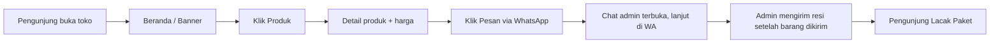
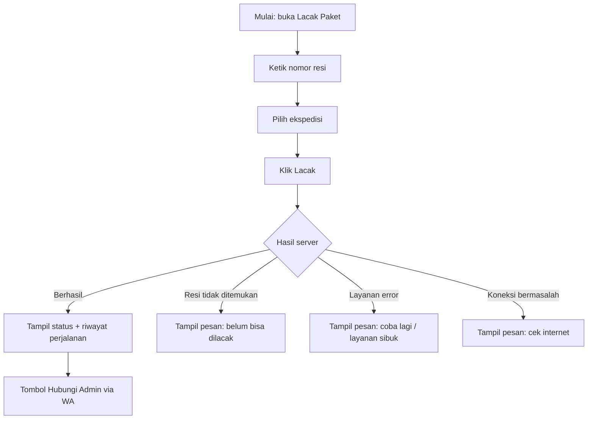
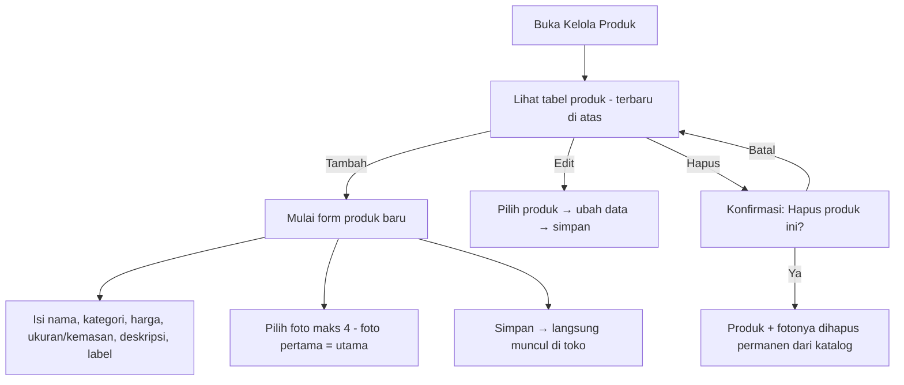
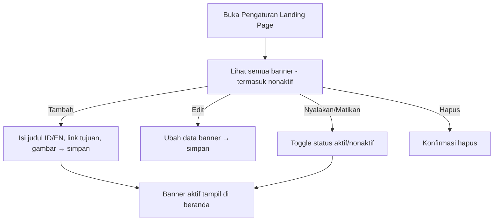
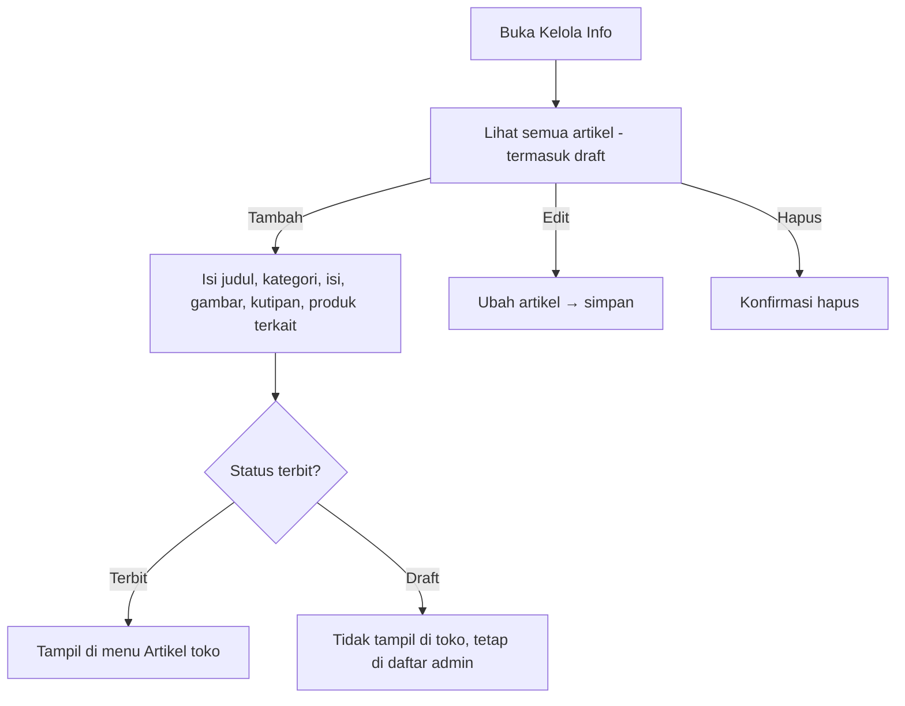
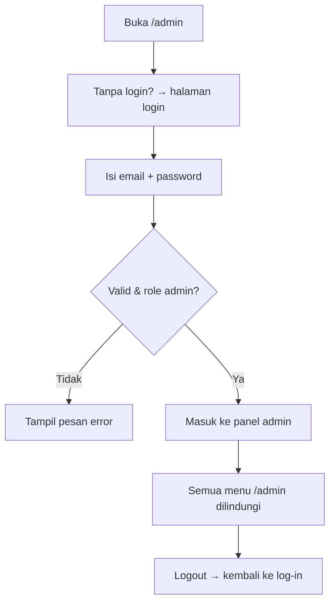
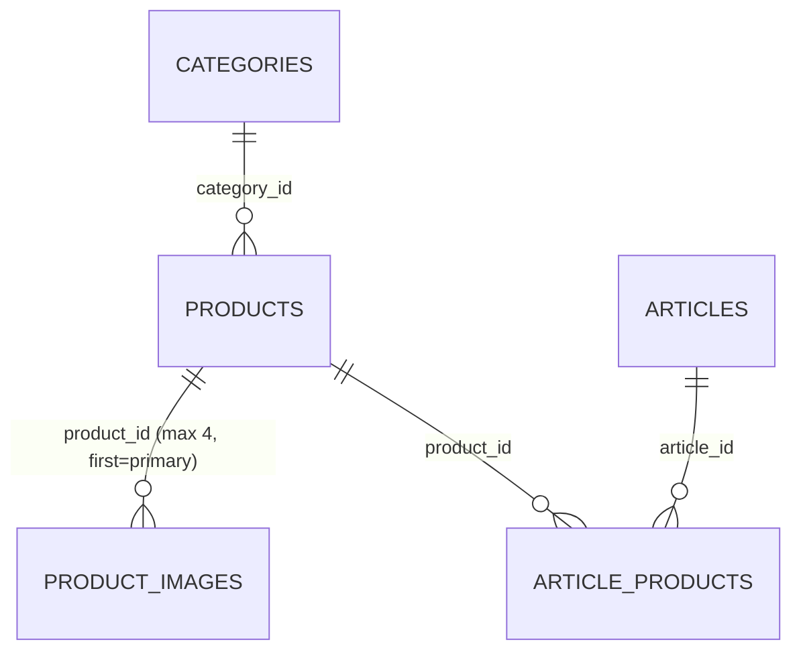

# 📋 Daftar Fitur & Alur Aplikasi — KWT E-Catalog Sorgum

> **KWT E-Catalog** = Katalog produk sorgum online untuk **Kelompok Wanita Tani (KWT)**.
> Aplikasi web yang memperlihatkan katalog produk sorgum (beras, tepung, camilan, pemanis, benih)
> kepada pengunjung, dengan menu lacak pengiriman, dan halaman admin untuk mengelola produk,
> banner, artikel, serta pengaturan toko.

Dokumen ini merangkum **fitur** dan **alur (flow)** utama aplikasi berdasarkan implementasi di `src/` dan `backend/`.

---

## 1. Ringkasan Aplikasi

| Aspek | Keterangan |
|---|---|
| Jenis aplikasi | Web app (React + Vite + TypeScript + Tailwind) dengan backend API (Node/Express + MySQL) |
| Pengguna utama | Admin KWT (mengelola toko) + pengunjung (melihat katalog, memesan, melacak) |
| Dua bagian tampilan | **Toko (publik)** & **Admin** — diakses lewat alamat `/admin` |
| Bahasa UI | Indonesia + English (bisa diganti dari dalam aplikasi) |
| Halaman publik | Landing, katalog produk, detail produk, artikel, lacak pengiriman |
| Autentikasi | Login di `/admin`, hanya akun admin yang bisa masuk |
| Keunikan | Pemesanan produk dilakukan **lewat WhatsApp** (bukan beli online); data admin & toko selalu sinkron |

> **Catatan penting:** aplikasi ini **tidak punya modul belanja online**. Tidak ada keranjang,
> checkout, pembayaran (QRIS), voucher, maupun wishlist. Seluruh pemesanan dialihkan ke
> **WhatsApp** dengan pesan otomatis yang sudah terisi nama produk.

---

## 2. Mode Tampilan

Aplikasi punya **2 bagian** yang dibedakan lewat alamat — **Toko publik** & **Admin**:

| Bagian | Path | Pengguna | Ciri |
|---|---|---|---|
| 🛍️ **Toko (publik)** | `/` | Pengunjung | Menu: Beranda, Produk, Artikel, Lacak Paket. Tampilan simple untuk melihat & memesan. |
| ⚙️ **Admin** | `/admin` | Admin/pengelola | Menu: Dashboard, Landing Page, Kelola Produk, Kelola Info, Kelola Lain. Mengelola seluruh isi toko. |

> Kedua bagian memakai **data yang sama** (satu database & state). Mode hanya mengubah cara tampil & kedalaman menu — perubahan admin langsung terlihat di toko tanpa refresh.

### 2.1 Tata Letak Responsif (Desktop & HP)

Tata letak dirancang **terpisah** untuk desktop dan HP — bukan sekadar mengecilkan tampilan desktop.

| Aspek | Desktop (≥768px) | HP (<768px) |
|---|---|---|
| Navigasi utama | Nav horizontal di header | **Bottom nav** (bar bawah layar) |
| Menu hamburger | — | **Tidak ada** (sudah diwakili bottom nav) |
| Pencarian | Di halaman Produk | **Search bar di header**, muncul di semua halaman |
| Grid produk | 4 kolom | **2 kolom** |
| Tombol pesan WA (detail produk) | Di bawah kolom kanan | **Tepat di bawah harga** (agar tidak terkubur) |
| Kartu artikel | Vertikal (gambar di atas) | **Horizontal** (gambar kiri, teks kanan) |
| Skala teks | 13–13.5px (rapat) | **15px** (lega) |
| Bottom nav | — | Tinggi area sentuh ≥44px + aman untuk iPhone (safe-area) |

---

## 3. Peta Halaman & Fitur

### 3.1 Halaman Publik (tanpa login)

| Route/Tab | Halaman | Fitur |
|---|---|---|
| `Beranda` | Landing page | Banner bergulir, produk unggulan, CTA ke produk/artikel |
| `Produk` | Katalog produk | Grid produk: foto, nama, harga, ukuran/kemasan, label kategori, tombol pesan. Dilengkapi pencarian + pengurutan |
| — (klik produk) | Detail produk | Foto (maks 4, foto pertama = utama), harga & rentang harga, deskripsi, komposisi, umur simpan, asal, info pengiriman, tombol **Pesan via WhatsApp** |
| `Artikel` | Daftar artikel | Artikel yang sudah terbit: judul, kategori, tanggal, gambar, penulis; klik → isi lengkap + produk terkait. Ada filter kategori + pencarian + paginasi |
| `Lacak Paket` | Lacak pengiriman | Input nomor resi + pilih ekspedisi → lihat status & riwayat perjalanan paket |

**Pencarian produk** — mencari berdasarkan **nama produk ATAU kategori**. Contoh: ketik
`camilan` → muncul semua produk kategori Camilan, meski nama produknya tidak memuat kata
"camilan". Deskripsi tidak diikutkan agar tidak salah cocok. Pencarian berjalan di sisi server
dan hasilnya konsisten antara Beranda dan halaman Produk.

Fitur umum toko:
- **Ganti bahasa**: Indonesia ↔ English (tombol pojok atas).
- **Mode gelap/terang**: tombol pojok atas.
- Kembali ke beranda dengan klik logo.
- **Lacak paket** juga bisa diakses dari bottom nav di HP.

### 3.2 Admin — `/admin`

Sidebar 5 menu:

| # | Menu | Tab | Fungsi inti |
|---|---|---|---|
| 1 | **Dashboard** | `dashboard` | Ringkasan metrik: jumlah produk, artikel, banner, dan info toko |
| 2 | **Pengaturan Landing Page** | `landing` | Kelola banner beranda + konten landing (judul/deskripsi hero, produk unggulan) |
| 3 | **Kelola Produk** | `produk` | CRUD produk (tambah, edit, hapus), foto maks 4, kategori, harga, nomor WA per produk |
| 4 | **Kelola Info** | `info` | CRUD artikel (terbit/draft), isi lengkap (blok teks/gambar/kutipan) + produk terkait |
| 5 | **Kelola Lain** | `lain` | Pengaturan toko: nama brand, logo, nomor WhatsApp admin |

Halaman tersembunyi (via URL, tidak di sidebar):
- Di E-Catalog tidak ada halaman tersembunyi — semua fitur admin ada di 5 menu sidebar di atas.

---

## 4. Alur Utama (End-to-End)

### 4.1 Alur Inti Katalog & Pemesanan



**Penjelasan singkat tiap tahap:**

1. **Beranda** — Banner + produk unggulan. Banner yang tampil hanya yang **aktif**.
2. **Katalog Produk** — Daftar semua produk (foto, nama, harga, ukuran/kemasan, label). Produk nonaktif tidak tampil.
3. **Detail Produk** — Info lengkap produk; tombol pesan membuka **WhatsApp ke nomor produk** itu sendiri (fallback: nomor global toko).
4. **Pesan via WhatsApp** — Transaksi berlanjut di chat WA; admin mengirim resi setelah barang dikirim.
5. **Lacak Paket** — Pengunjung memantau status & riwayat perjalanan paket.

### 4.2 Alur Detail — Lacak Paket (Tracking)



**Aturan penting:**
- Ekspedisi dipilih dari daftar **61 ekspedisi** (J&T, JNE, SiCepat, Anteraja, Ninja, Lion Parcel, dll), lengkap dengan kolom pencarian.
- Resi error ditangani dengan **pesan ramah** yang membedakan "resi tidak ditemukan" vs "kendala teknis" — bukan halaman error / aplikasi rusak.
- Pelacakan diteruskan backend ke layanan pihak ketiga (cek-resi) lewat proxy.

### 4.3 Alur Detail — Admin Kelola Produk



**Aturan penting:**
- **Foto maksimal 4**, foto pertama selalu jadi foto utama.
- **Nama & harga tidak boleh kosong** — muncul peringatan bila kosong.
- Hapus produk = **hapus permanen** (produk + semua fotonya). Tidak ada mode sembunyikan/soft-delete.
- Setiap simpan/hapus → data langsung sinkron ke toko.

### 4.4 Alur Detail — Admin Kelola Banner



- Banner **nonaktif** tetap terlihat di daftar admin, tapi tidak muncul di beranda toko.
- Gambar banner sebaiknya di-upload ke server sendiri (folder `/uploads`) — hindari memakai
  tautan gambar dari situs lain, karena bisa gagal dimuat (mis. sertifikat SSL situs tersebut
  kadaluarsa) dan banner tampil kosong.

### 4.5 Alur Detail — Admin Kelola Artikel



- Isi artikel disusun dari **blok berurutan**: teks, gambar (dengan caption), dan kutipan (dengan penulis).

### 4.6 Alur Autentikasi Admin



- Login dengan akun **bukan admin** → peringatan "hanya admin yang bisa login di /admin".
- Belum ada fitur lupa password / reset password mandiri — akun admin dibuat/diatur dari sisi server (tabel `users`).

---

## 5. Relasi Data (Ringkas)



Catatan: `banners` dan `landing_content` **berdiri sendiri** (tidak berelasi ke tabel lain).
`landing_content` adalah tabel key–value untuk konten landing (judul hero, daftar ID produk
unggulan, dsb).

Tabel yang dipakai aplikasi: `categories`, `products`, `product_images`, `banners`,
`articles`, `article_products`, `landing_content`, `site_settings`, `users`.

> Beberapa tabel warisan masih ada di skema database (`orders`, `order_items`, `cart_items`,
> `wishlists`, `user_addresses`, `tracking_logs`, `tracking_history`, `password_reset_tokens`)
> tetapi **tidak lagi dipakai** oleh kode aplikasi — modul belanja online sudah dihapus dan
> digantikan pemesanan lewat WhatsApp.

Endpoint API yang aktif: `/api/auth`, `/api/products`, `/api/categories`, `/api/banners`,
`/api/articles`, `/api/settings`, `/api/landing-content`, `/api/tracking`,
`/api/admin/settings`, `/api/admin/products`, `/api/admin/banners`, `/api/admin/articles`,
`/api/admin/upload`, `/api/events` (SSE), `/api/health`.

---

## 6. Fitur Administrasi Pendukung

### Banner (Landing Page)
- Kelola banner halaman depan; status **aktif / nonaktif**; fitur nyalakan & matikan.
- Dashboard menampilkan jumlah banner.

### Produk & Kategori
- Kelola produk dengan kategori (Beras / Tepung / Camilan / Pemanis / Benih).
- Foto produk maks 4, foto pertama = utama.
- Form admin punya penanda **bebas gluten** & **organik** (data tersimpan di DB; belum ditampilkan di kartu/detail produk toko).

### Artikel (Info)
- Kelola artikel edukasi produk sorgum.
- Artikel bisa **terbit atau draft**; yang terbit tampil di toko, draft tidak.
- Artikel bisa dikaitkan ke **produk terkait**.
- Kategori artikel: Nutrisi, Budidaya, Inspirasi, Resep Sehat, Cerita Petani, Promosi.

### Pengaturan Toko (Kelola Lain)
- Ubah **nama brand toko**, **logo**, dan **nomor WhatsApp admin**.
- Nama & logo dipakai di header, footer, dan menu admin.
- Nomor WhatsApp dipakai di footer, banner kemitraan, tombol bantuan lacak paket, dan
  menjadi nomor tujuan produk yang tidak punya nomor WA sendiri.

### Pelacakan (Tracking)
- Lacak paket memakai nomor resi + ekspedisi (integrasi layanan cek-resi).

---

## 7. Fitur Proteksi & Keamanan Data (Penting)

1. **Penghapusan produk bersifat permanen** — produk + seluruh fotonya dihapus dari katalog (ada modal konfirmasi sebelum eksekusi).
2. **Upload gambar dibatasi ukuran** (default 1 MB per file, env `ECATALOG_BESTARI_MAX_FILE_SIZE`) — belum ada kompresi otomatis di server. *(Prefix env `BESTARI_` sengaja dipertahankan agar tidak memutus konfigurasi server.)*
3. **Foto produk** — maksimal 4, foto pertama jadi utama.
4. **Notifikasi via Toast** (bukan `alert()`).
5. **Route admin dilindungi** — hanya `user.role === 'admin'` yang bisa masuk /admin; token disimpan di localStorage.
6. **Data admin & toko selalu sinkron** — perubahan langsung tampil tanpa refresh (lewat SSE).
7. **Tidak menampilkan ID internal** produk/pesanan ke pengunjung (kontrak UI).
8. **Bahasa** — UI Indonesia & English seimbang (`locales/id.ts` + `en.ts`).

---

## 8. Cara Menjalankan (Ringkas)

```bash
# Terminal 1 — Frontend (port 3000)
npm install
npm run dev

# Terminal 2 — Backend (port 20203)
cd backend
npm install
npm run dev
```

- Frontend: http://localhost:3000
- Backend: http://localhost:20203/api/health
- Migrasi DB: `cd backend && npm run db:migrate`
- Konfigurasi: salin `backend/.env.example` → `backend/.env`, isi `JWT_SECRET` & kredensial DB
- Produksi: `catalog.livinglabs.id`

---

*Dokumen ini disusun berdasarkan kode sumber. Jika ada perubahan fitur, perbarui dokumen ini.*
