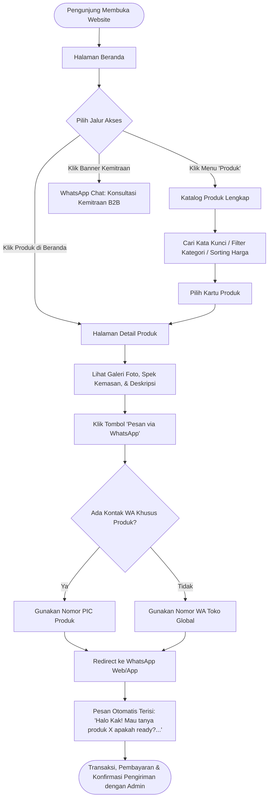
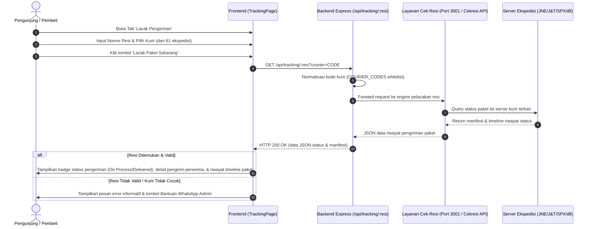
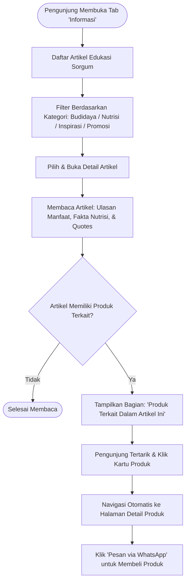
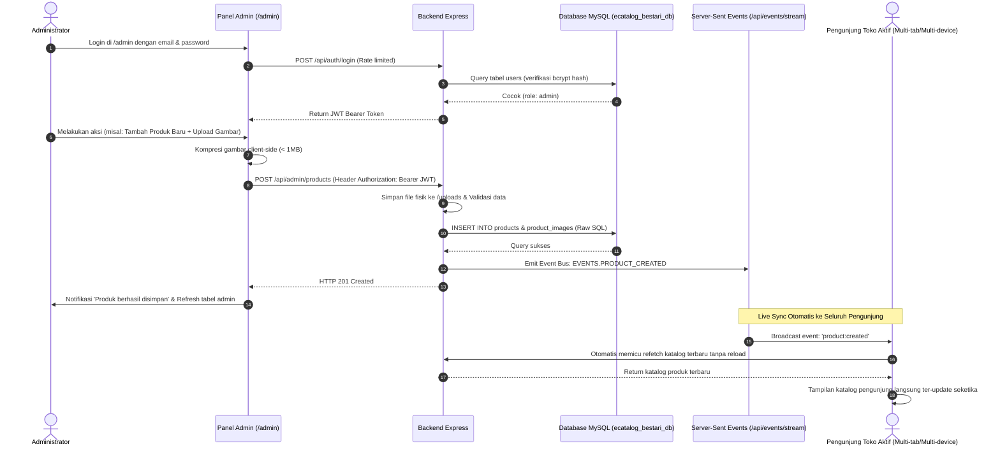

# Dokumentasi Fitur Utama & Alur Kerja (Flow)
## BESTARI - Sorgum E-Catalog System

Dokumen ini memuat daftar lengkap fitur utama serta representasi alur kerja (*user flow*, *system flow*, dan *data synchronization flow*) pada platform **BESTARI Sorgum E-Catalog**.

---

## 1. Arsitektur & Gambaran Umum Sistem

BESTARI Sorgum E-Catalog dirancang sebagai platform katalog digital interaktif dan edukatif untuk mempromosikan serta memasarkan produk olahan sorgum murni. Sistem mengadopsi konsep:
- **Frontend**: Single Page Application (SPA) berbasis state tab navigasi menggunakan React 19, TypeScript, Vite, Tailwind CSS v4, dan i18n dwibahasa (ID/EN).
- **Backend**: RESTful API berbasis Node.js 20+, Express 5, TypeScript, dan database MySQL 8 dengan query *raw SQL* (`mysql2/promise`).
- **Realtime Sync**: Server-Sent Events (SSE) via `/api/events/stream` untuk memperbarui data katalog pelanggan secara langsung saat admin melakukan perubahan tanpa perlu reload halaman.
- **Transaksi Cepat**: Pemesanan direct order berbasis WhatsApp API yang menghubungkan pembeli langsung ke admin/penjual produk secara personal dan ramah.
- **Shipment Tracking**: Pelacakan nomor resi terintegrasi proxy service dengan dukungan 61 ekspedisi logistik di Indonesia.

---

## 2. Daftar Fitur Utama

### A. Fitur Pengunjung / Pembeli (Public E-Catalog)

#### 1. Beranda Interaktif (Home Page)
- **Hero Carousel Banner**: Slide banner promosi dinamis yang dikelola oleh admin, dilengkapi tombol aksi cepat (*Shop Now* dan *Read More*).
- **Koleksi Produk Pilihan (Featured Products)**: Menampilkan 4 produk unggulan hasil kurasi langsung admin di panel back-office.
- **Banner Kemitraan B2B & Pasokan Usaha**: Section ajakan kerja sama pasokan sorgum untuk restoran, produsen makanan sehat, hotel, dan retail dengan tombol direct chat WhatsApp.
- **Pencarian Cepat di Beranda**: Kolom pencarian instan yang langsung menyaring katalog produk secara reaktif.

#### 2. Eksplorasi Katalog Produk (Products Catalog)
- **Pencarian Multi-parameter**: Filter instan berdasarkan nama produk, deskripsi, maupun satuan kemasan.
- **Pengurutan (Sorting)**:
  - *Populer* (default rekomendasi)
  - *Harga Terendah*
  - *Harga Tertinggi*
  - *Terbaru*
- **Sistem Kategori Produk**: Pengelompokan produk otomatis (Beras Sorgum, Biji, Tepung, Camilan/Snack, dsb.) dengan badge warna tematik.

#### 3. Halaman Detail Produk (Shopee-Style Product Detail)
- **Galeri Foto Interaktif**: Preview foto produk utama dengan selector thumbnail galeri multi-sudut.
- **Informasi Harga Fleksibel**: Mendukung harga tunggal maupun rentang harga (*price range* misal: `Rp 25.000 - Rp 50.000`).
- **Spesifikasi Produk Terstruktur**:
  - Informasi berat dan jenis kemasan (*unit info*).
  - Jaminan pengiriman ke seluruh nusantara.
  - Deskripsi produk lengkap dengan fitur *Expand/Collapse* (Baca Selengkapnya / Sembunyikan).
- **Direct Order WhatsApp Generator**:
  - Tombol aksi utama *"Pesan via WhatsApp"* dengan template pesan otomatis ramah pelanggan yang menyebutkan nama produk secara presisi.
  - Mendukung nomor WhatsApp spesifik per produk (jika produk memiliki kontak PIC tersendiri) atau otomatis fallback ke nomor WhatsApp toko global.
- **Produk Terkait (Cross-Selling)**: Rekomendasi 4 produk lain dalam kategori yang sama di bagian bawah halaman detail.
- **Navigasi Breadcrumb**: Penelusuran hierarki halaman (Beranda > Produk > Nama Produk) beserta tombol cepat *Kembali ke Katalog*.

#### 4. Pelacakan Pengiriman (Live Shipment Tracking)
- **Multi-Ekspedisi Logistik**: Mendukung hingga **61 jasa pengiriman** di Indonesia (J&T Express, JNE, Shopee Express/SPX, SiCepat, Lion Parcel, Pos Indonesia, TIKI, Anteraja, Wahana, Indah Cargo, Ninja Xpress, ID Express, Paxel, dsb.).
- **Selector Kurir Interaktif**: Pencarian nama kurir secara instan di dalam dropdown selector ekspedisi.
- **Visualisasi Status Perjalanan**: Menampilkan ringkasan status pengiriman, nama pengirim, nama penerima, kota tujuan, dan riwayat timeline perjalanan paket terperinci dari waktu ke waktu.
- **Pusat Bantuan Resi**: Tautan direct WhatsApp ke admin jika pengguna membutuhkan bantuan konfirmasi pesanan/paket.

#### 5. Pusat Informasi & Edukasi Sorgum (Articles & Blog)
- **Kategori Artikel**: *Budidaya*, *Nutrisi*, *Inspirasi*, dan *Promosi*.
- **Pencarian & Pagination Artikel**: Menyaring artikel edukasi berdasarkan kata kunci judul dan cuplikan konten dengan pembagian 6 artikel per halaman.
- **Halaman Baca Artikel Mendalam**:
  - Konten kaya (*rich text* & paragraf).
  - Gambar utama dan sub-gambar pendukung.
  - Kutipan inspiratif (*quote block*).
  - Fakta nutrisi sorgum (*quick facts highlight*).
- **Tautan Rekomendasi Produk pada Artikel**: Artikel dapat menampilkan kartu produk sorgum yang relevan dengan topik yang sedang dibahas, mendorong pembaca langsung menjelajahi produk terkait.

#### 6. Pengalaman Pengguna (UX & Global Features)
- **Dukungan Dwibahasa (Multilingual i18n)**: Penggantian bahasa instan antara **Bahasa Indonesia** dan **English** tanpa reload browser.
- **Mode Tampilan (Theme Switcher)**: Pilihan tema **Light Mode** (ramah mata bernuansa earthy) dan **Dark Mode** (kontras elegan).
- **Deteksi Koneksi Server (Network Resilience)**: Modal indikator jika server backend offline atau terjadi kegagalan jaringan, dilengkapi mekanisme *auto-retry* 2x otomatis.
- **Mobile Responsive**: Tampilan dioptimalkan untuk perangkat mobile dengan *Mobile Bottom Navigation bar*.

---

### B. Fitur Administrator (Back-Office Admin Panel)

Akses melalui URL `/admin`:

#### 1. Autentikasi & Keamanan
- **Proteksi Akses Admin**: Autentikasi JWT (JSON Web Token) dengan penyimpanan sesi aman.
- **Rate Limiting**: Pencegahan brute-force login pada rute autentikasi (maksimal 20 percobaan per 15 menit per IP).
- **Otorisasi Berbasis Peran**: Hanya pengguna dengan `role: admin` yang dapat mengakses dashboard dan endpoint admin.

#### 2. Dashboard Ringkasan Toko
- **Kartu Metrik KPI**:
  - Total produk aktif terdaftar.
  - Jumlah artikel edukasi yang dipublikasikan.
  - Jumlah banner promosi aktif di beranda.
- **Quick Links**: Tombol cepat menuju tambah produk baru dan pratinjau toko publik.
- **Status Operasional**: Menampilkan nomor WhatsApp admin toko yang aktif menerima pesanan.

#### 3. Kelola Konten Beranda (Landing CMS)
- **Kelola Slide Banner**:
  - Tambah banner baru dengan judul (ID & EN), gambar, dan tautan tujuan (*target link*).
  - Toggle aktif/nonaktifkan banner tanpa menghapus data.
  - Pratinjau gambar banner.
- **Pengaturan Teks Landing Page**:
  - Mengubah judul hero, slogan, deskripsi, dan poin keunggulan sorgum.
  - Sinkronisasi otomatis terjemahan bahasa.
- **Kurasi Produk Pilihan**:
  - Memilih produk-produk tertentu menggunakan modal checklist interaktif untuk ditampilkan di section *"Koleksi Produk Pilihan"* beranda.

#### 4. Manajemen Produk (Product Management)
- **Daftar Tabel Produk**: Tampilan tabel ringkas 6 kolom dengan urutan data terbaru (`id DESC`).
- **Form Produk Komprehensif**:
  - Nama produk dan slug otomatis.
  - Kategori produk (sinkron dari tabel kategori database).
  - Pengaturan harga: Harga tunggal atau batas rentang harga (*price max*).
  - Satuan kemasan (*unit info*, misal: `1 kg`, `500 gr`, `Pouch 250g`).
  - Nomor kontak WhatsApp khusus produk (opsional).
  - Deskripsi lengkap produk.
  - Galeri Multi-Gambar: Upload hingga 4 gambar produk dengan optimasi kompresi otomatis client-side (<1 MB).
- **Hapus Aman**: Modal konfirmasi penghapusan produk untuk mencegah ketidaksengajaan.

#### 5. Manajemen Artikel Informasi (Article Management)
- **Kelola Artikel Edukasi**: Tambah, edit, dan hapus artikel informasi.
- **Penyusunan Konten Lengkap**:
  - Kategori, judul, slug, penulis, dan tanggal publikasi.
  - Gambar sampul (*primary image*) dan sub-gambar (*sub-image*).
  - Blok kutipan (*quote*) dan daftar fakta nutrisi (*nutritional facts*).
  - Status publikasi (*isPublished*).
- **Penautan Relasi Produk (Product Tagging)**: Admin dapat memilih produk-produk yang relevan untuk disematkan di dalam artikel terkait.

#### 6. Pengaturan Toko (Shop Settings)
- **Identitas Toko**: Nama toko, alamat operasional, dan email kontak.
- **Nomor WhatsApp Utama**: Nomor penerima transaksi pemesanan dan konsultasi kemitraan.
- **Branding Toko**: Upload file logo toko dan favicon secara langsung ke storage server.

#### 7. Realtime Sync Engine (Server-Sent Events)
- **Sinkronisasi Otomatis**: Setiap aksi simpan/edit/hapus produk, banner, artikel, dan pengaturan toko akan menyiarkan event SSE ke seluruh browser pengunjung yang aktif, memastikan katalog selalu mutakhir seketika.

---

## 3. Diagram & Alur Kerja (Flowchart)

### Alur 1: Penjelajahan Katalog & Pemesanan Produk oleh Pengunjung

---

### Alur 2: Pelacakan Resi Pengiriman (Shipment Tracking)

---

### Alur 3: Alur Edukasi & Cross-Selling (Artikel ↔ Produk)

---

### Alur 4: Manajemen Admin & Sinkronisasi Realtime (SSE)

---

## 4. Ringkasan Endpoint API Utama

| Modul | Method | Endpoint | Akses | Deskripsi |
|---|---|---|---|---|
| **Katalog Produk** | `GET` | `/api/products` | Publik | Ambil daftar produk (filter, search, sort) |
| | `GET` | `/api/products/:id` | Publik | Ambil detail lengkap satu produk |
| | `GET` | `/api/categories` | Publik | Ambil daftar kategori produk |
| **Artikel** | `GET` | `/api/articles` | Publik | Ambil daftar artikel publik |
| | `GET` | `/api/articles/:slug` | Publik | Ambil detail artikel lengkap beserta produk terkait |
| **Banner & Landing** | `GET` | `/api/banners` | Publik | Ambil banner promosi aktif di beranda |
| | `GET` | `/api/landing-content` | Publik | Ambil teks & ID produk pilihan beranda |
| **Pelacakan Resi** | `GET` | `/api/tracking/:resi` | Publik | Proxy pelacakan paket ekspedisi (61 kurir) |
| **Realtime Sync** | `GET` | `/api/events/stream` | Publik | Server-Sent Events stream untuk sinkronisasi data |
| **Pengaturan Toko**| `GET` | `/api/settings` | Publik | Ambil nama toko, logo, dan kontak WhatsApp |
| **Autentikasi** | `POST` | `/api/auth/login` | Publik (Rate-limited) | Login admin & generate JWT token |
| | `GET` | `/api/auth/me` | Admin | Validasi sesi token aktif |
| **Kelola Produk** | `POST` | `/api/admin/products` | Admin | Tambah produk baru beserta gambar |
| | `PUT` | `/api/admin/products/:id`| Admin | Perbarui informasi produk |
| | `DELETE` | `/api/admin/products/:id`| Admin | Hapus produk dari database |
| **Kelola Artikel**| `POST` | `/api/admin/articles` | Admin | Tambah artikel edukasi baru |
| | `PUT` | `/api/admin/articles/:id`| Admin | Edit artikel & tautan produk terkait |
| | `DELETE` | `/api/admin/articles/:id`| Admin | Hapus artikel |
| **Kelola Banner** | `GET` | `/api/admin/banners` | Admin | Ambil semua banner (aktif maupun nonaktif) |
| | `POST` | `/api/admin/banners` | Admin | Tambah banner baru |
| | `PATCH` | `/api/admin/banners/:id/toggle` | Admin | Aktifkan/nonaktifkan banner |
| | `DELETE` | `/api/admin/banners/:id` | Admin | Hapus banner |
| **Kelola Pengaturan** | `PUT` | `/api/admin/settings` | Admin | Simpan perubahan identitas toko & kontak |
| | `POST` | `/api/admin/upload` | Admin | Upload file gambar (logo, favicon, foto) |

---

*Dokumen ini dibuat secara terstruktur berdasarkan codebase resmi BESTARI Sorgum E-Catalog (September 2026).*
